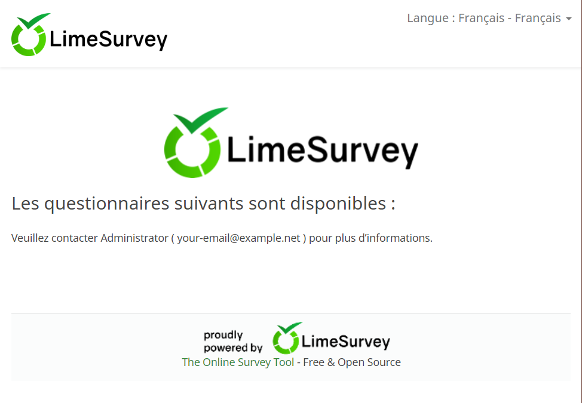
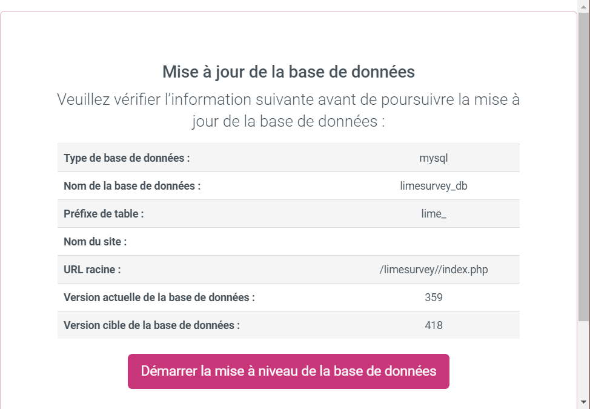

# LimeSurvey

<p align="center">

</p>

## What is LimeSurvey?

[](http://inch-ci.org/github/JayBeeDe/docker_limesurvey) [](http://hits.dwyl.com/JayBeeDe/docker_limesurvey)

LimeSurvey is the worldwide leading open source survey software as a professional solution. It enables users using a web interface to develop and publish on-line surveys, collect responses, create statistics, and export the resulting data to other applications.

[https://www.limesurvey.org/](https://www.limesurvey.org/)

## Quick reference

- [Demo Page](https://demo.limesurvey.org/index.php?r=admin/authentication/sa/login&loginlang=en)

- [Download Page](https://www.limesurvey.org/about-limesurvey/download)

- [GitHub](https://github.com/LimeSurvey/LimeSurvey)

- [Documentation](https://manual.limesurvey.org/LimeSurvey_Manual)

- [Bug Tracker](https://www.limesurvey.org/community/bug-tracker)

- [Forum](https://www.limesurvey.org/community/forums)

- [Contact](https://www.limesurvey.org/about-us/imprint)

- [IRC Live Chat](https://www.limesurvey.org/community/live-chat)

- [License](https://www.limesurvey.org/about-limesurvey/license) [GPL-2](https://www.gnu.org/licenses/old-licenses/gpl-2.0.en.html)

- [Plugin Page](https://www.limesurvey.org/community/extensions)

- [Hub](https://www.limesurvey.org/limestore)

- [Blog](https://www.limesurvey.org/about-us/blog)

## How to use this image

<aside class="warning">
Despite the fact that limesurvey is compatible with PostgreSQL and Microsoft SQL, this image only support MySQL database.
</aside>

### LimeSurvey Full-Automatic Install

First we start the mySQL container:

```shell
docker run -d -it --name limesurvey-db -e MYSQL_DATABASE=myNiceDbName -e MYSQL_USER=myNiceDbUserName -e MYSQL_PASSWORD=myNiceDbPassword -e MYSQL_ROOT_PASSWORD=myNiceROOTDbPassword --restart=always --hostname=limesurvey-db mysql:5.7
```

Then we start the limesurvey container (replace with the correct environnement variables):

```shell
docker run -d -it --name limesurvey-ui --link limesurvey-db:mysql -e dbHost="limesurvey-db" -e dbName="myNiceDbName" -e dbUser="myNiceDbUserName" -e dbPass="myNiceDbPassword" -e backOfficeUser="myNiceBOUserName" -e backOfficePassword="myNiceBOPassword" -e backOfficeLanguage="fr" -e urlPrefix="/limesurvey/" --restart=always --hostname=limesurvey-ui jbd92/limesurvey:latest
```
This example shows a configuration behind a proxy, this is why the urlPrefix has been set. You can set it to / or remove it if you don't use a configuration behind a proxy.

Once you get the shell back, wait around 1 min the first time in order to get the database initialized.

Once finished, you can open your browser and you will see the home page:
<p align="center">

</p>

Go to [index.php?r=admin](index.php?r=admin) in order to login with the backofffice credentials previously set in the environnement variables.

If needed, you will be first redirected to [index.php?r=admin/databaseupdate/sa/db](index.php?r=admin/databaseupdate/sa/db) in order to update the database. Run the update and wait, don't refresh your web browser during the update.

<p align="center">

</p>

That's it!

## Environment Variables

As you can see, there are several environment variables. Here is the full list with their default values:

Docker Environment Var. | Default Value | Description
------------- | ------------- | -------------
dbName | limesurvey_db_name | MySQL database name
dbHost | limesurvey_db_host | MySQL hostname
dbPort | 3306 | MySQL port
dbUser | limesurvey_db_user | MySQL user
dbPass | limesurvey_db_pwd | MySQL password
backOfficeUser | limesurvey_backoffice_user | Backoffice user
backOfficePassword | limesurvey_backoffice_password | Backoffice password
backOfficeLanguage | en | 
urlPrefix | / | Path to the root application folder. Make sense when behind a proxy.

## License

This program is free software; you can redistribute it and/or modify it under the terms of the GNU General Public License as published by the Free Software Foundation; [version 2](https://www.gnu.org/licenses/old-licenses/gpl-2.0.en.html) of the License.
